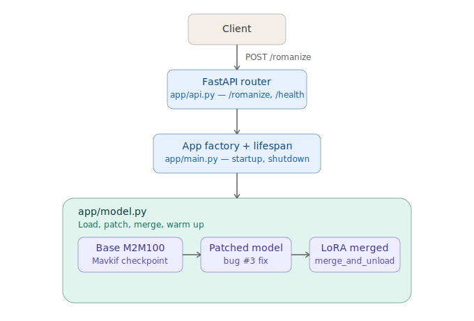
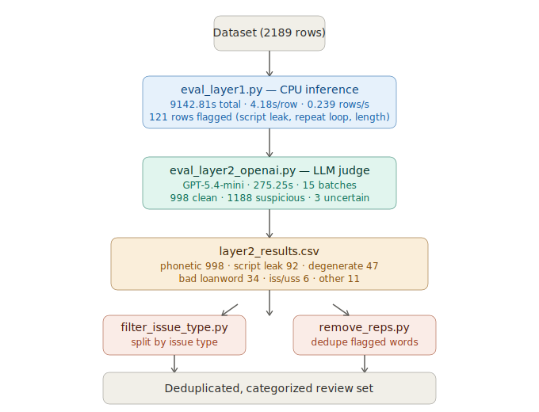

# Romanize API — Deployment Guide

Production FastAPI service for the fine-tuned M2M100 LoRA Urdu → Roman Urdu transliteration model.

---

## Project structure

```
romanize_api/
├── app/
│   ├── __init__.py        # package marker
│   ├── config.py          # all env-driven settings — single source of truth
│   ├── model.py           # model loading, patching, warm-up, transliterate()
│   ├── api.py             # FastAPI router — /romanize and /health endpoints
│   └── main.py            # app factory, lifespan (startup/shutdown), uvicorn entry
├── fine_tuned_model/      # LoRA adapter weights — place this here
│   ├── adapter_config.json
│   ├── adapter_model.safetensors
│   ├── added_tokens.json
│   ├── sentencepiece.bpe.model
│   ├── tokenizer_config.json
│   └── vocab.json
├── scripts/
│   └── start.sh           # production startup script
├── eval_layer1.py         # layer 1 evaluation of model outputs
├── eval_layer2_openai.py  # layer 2 evaluation using OpenAI API as judge
├── inspect_layer1.py      # inspect/debug layer 1 results
├── estimate_cost.py       # estimate OpenAI API cost for layer 2 eval
├── filter_issue_type.py   # filter evaluation results by issue type
├── remove_reps.py         # dedupe repeated words from incorrect-words lists
├── requirements.txt
└── README.md
```

---

## Architecture



Client requests hit the FastAPI router (`app/api.py`), which is initialized via the app factory's lifespan hook (`app/main.py`) on startup. `app/model.py` loads the base M2M100 checkpoint, applies the bug #3 patch, and merges the LoRA adapter weights into a single warm model before the service starts accepting traffic.

---

## Prerequisites

- Python 3.10+
- NVIDIA GPU with CUDA (tested on A5000 24 GB)
- The trained adapter directory (`fine_tuned_model/`) inside `romanize_api/`

---

## Setup

### 1. Install dependencies

```bash
cd romanize_api
pip install -r requirements.txt
```

### 2. Verify the model directory is in place

```
romanize_api/fine_tuned_model/
├── adapter_config.json
├── adapter_model.safetensors   ← the 18 MB LoRA weights
├── added_tokens.json
├── sentencepiece.bpe.model
├── tokenizer_config.json
└── vocab.json
```

No configuration file needed. All defaults work out of the box with this layout.
To override anything, pass env vars directly on the command line (see below).

---

## Starting the server

### Option A — startup script (recommended)

```bash
chmod +x scripts/start.sh
./scripts/start.sh
```

With overrides:

```bash
PORT=8080 ./scripts/start.sh
MODEL_DIR=/data/fine_tuned_model PORT=9000 ./scripts/start.sh
```

### Option B — direct uvicorn

```bash
uvicorn app.main:app --host 0.0.0.0 --port 2000 --workers 1
```

### Option C — Python

```bash
python -m app.main
```

---

## Expected startup log

```
2024-01-15 10:00:00  INFO      app.main  ============================================================
2024-01-15 10:00:00  INFO      app.main  Romanize API starting up
2024-01-15 10:00:00  INFO      app.main    HOST      : 0.0.0.0
2024-01-15 10:00:00  INFO      app.main    PORT      : 2000
2024-01-15 10:00:00  INFO      app.main    MODEL_DIR : ./fine_tuned_model
2024-01-15 10:00:01  INFO      app.model  Using device: cuda
2024-01-15 10:00:01  INFO      app.model  Loading base model 'Mavkif/m2m100_rup_ur_to_rur' ...
2024-01-15 10:00:20  INFO      app.model  Applying PatchedM2M100Model (bug #3 fix) ...
2024-01-15 10:00:21  INFO      app.model  Loading LoRA adapters from './fine_tuned_model' ...
2024-01-15 10:00:22  INFO      app.model  Merging LoRA adapters into base weights ...
2024-01-15 10:00:24  INFO      app.model  Model ready on cuda.
2024-01-15 10:00:24  INFO      app.model  Loading tokenizer from './fine_tuned_model' ...
2024-01-15 10:00:24  INFO      app.model  Running warm-up (3 sentence(s)) ...
2024-01-15 10:00:26  INFO      app.model  warm-up: 'وہ گھر پر نہیں ہے' → 'woh ghar par nahi hai'
2024-01-15 10:00:26  INFO      app.model  Warm-up complete. Service is ready.
2024-01-15 10:00:26  INFO      app.main   Romanize API is READY. Accepting requests.
2024-01-15 10:00:26  INFO      app.main     POST http://0.0.0.0:2000/romanize
2024-01-15 10:00:26  INFO      app.main     GET  http://0.0.0.0:2000/health
```

The server only starts accepting requests after "Romanize API is READY." appears.

---

## API reference

### POST /romanize

Transliterates a single Urdu Arabic-script string to Roman Urdu.

**Request:**

```bash
curl -X POST http://localhost:2000/romanize \
     -H "Content-Type: application/json" \
     -d '{"text": "آپ کیسے ہیں؟"}'
```

**Response (200):**

```json
{
  "romanized_text": "Aap kaise hain?"
}
```

**More examples:**

```bash
# Tech/loanword vocabulary (what the fine-tune fixed)
curl -X POST http://localhost:2000/romanize \
     -H "Content-Type: application/json" \
     -d '{"text": "وہ روز ایکسرسائز کرتا ہے"}'
# → { "romanized_text": "woh roz exercise karta hai" }

curl -X POST http://localhost:2000/romanize \
     -H "Content-Type: application/json" \
     -d '{"text": "اس کا لیپ ٹاپ کریش ہو گیا"}'
# → { "romanized_text": "uss ka laptop crash ho gaya" }

# Empty / blank input → 400
curl -X POST http://localhost:2000/romanize \
     -H "Content-Type: application/json" \
     -d '{"text": "   "}'
# → { "detail": "Value error, text must not be empty or whitespace-only." }
```

**Error responses:**

| Status | When |
|--------|------|
| 400 | Blank or invalid input |
| 503 | Model still loading (shouldn't happen in normal operation) |
| 500 | Unexpected inference failure (check logs) |

### GET /health

Lightweight readiness probe.

```bash
curl http://localhost:2000/health
```

**Response (200 — ready):**

```json
{
  "status": "ok",
  "model_ready": true,
  "device": "cuda"
}
```

**Response (503 — still loading):**

```json
{
  "status": "unavailable",
  "model_ready": false,
  "device": "unknown"
}
```

Use `/health` in your load balancer or systemd `ExecStartPost` to gate traffic until the model is warm.

### Interactive docs

FastAPI ships with auto-generated docs:

- Swagger UI: `http://localhost:2000/docs`
- ReDoc: `http://localhost:2000/redoc`

---

## Environment variables

No config file needed. All variables have working defaults. Override on the command line as needed.

| Variable | Default | Description |
|---|---|---|
| `HOST` | `0.0.0.0` | Bind address |
| `PORT` | `2000` | Listen port |
| `MODEL_DIR` | `./fine_tuned_model` | Path to LoRA adapter directory |
| `NUM_BEAMS` | `4` | Beam search width |
| `MAX_NEW_TOKENS` | `128` | Max Roman Urdu tokens per sentence |
| `INFERENCE_BATCH_SIZE` | `8` | Max sentences per generate() call |
| `WARMUP_SENTENCES` | `3` | Dummy calls on startup (1–3) |
| `LOG_LEVEL` | `INFO` | `DEBUG` / `INFO` / `WARNING` / `ERROR` |

---

## Architecture notes

### Why `workers=1`

The model (488M params after adapter merge, ~1 GB in fp16) lives in VRAM. Forking multiple uvicorn worker processes after model load does **not** share VRAM — each worker would need its own copy. `workers=1` keeps one model in memory. Scale horizontally by running one container per GPU behind nginx.

### Why warm-up

CUDA kernels and cuDNN algorithm selection happen on the first forward pass. Without warm-up, the first real request pays 2–5 seconds of compilation latency. With 3 warm-up sentences the first request is as fast as all subsequent ones.

### Why `merge_and_unload()`

After loading `PeftModel`, calling `merge_and_unload()` bakes the LoRA adapter weights (∆W = B×A scaled by α/r) into the frozen base weights and removes the PEFT wrapper entirely. The result is a standard `M2M100ForConditionalGeneration` with no adapter overhead per forward pass — same weights, faster inference.

### Why single GPU (CUDA_VISIBLE_DEVICES=0)

Mirrors the training constraint (bug #10 in train.py). DataParallel + fp16 + custom loss caused catastrophic divergence during training. The inference service inherits the same constraint for consistency and simplicity.

### Why no root endpoint

`/` is unmounted intentionally. A request to `/` returns 404, making it immediately obvious if a client has the wrong URL rather than silently returning a generic response.

---

## Baseline performance (CPU)

`eval_layer1.py` was run against all 2189 dataset rows on **CPU** (no GPU) as a baseline measurement of the fine-tuned model's raw inference speed, before any deployment optimizations:

| Metric | Value |
|---|---|
| Total wall clock | 9142.81s (~2.5 hours) |
| Avg latency / row | 4.177s |
| Throughput | 0.239 rows/sec |
| Batches | 137 |
| Min / max batch latency | 8.72s / 402.78s |
| Flagged rows | 121 (93 script leakage, 26 repeat loop, 13 length outlier) |

This is the number the GPU deployment (see "Why workers=1" above) is meant to improve on — there is no GPU-mode benchmark run yet, so a direct CPU-vs-GPU speedup figure isn't available. Treat CPU numbers as the pre-optimization floor.

For reference, `eval_layer2_openai.py` (a separate LLM-judge pass over the same 2189 rows, using GPT-5.4-mini via the OpenAI API) completed in 275.25s across 15 batches — not a fair comparison to layer 1 since it's a different model doing a different task (judging quality, not transliterating), but included here since it's the other end-to-end timing we have.

---

## Evaluation & data-processing scripts



These scripts support the model evaluation workflow and are separate from the deployed API service.

| Script | Purpose |
|---|---|
| `eval_layer1.py` | Runs the first evaluation pass over the model's transliteration outputs and writes `layer1_results.csv`. |
| `inspect_layer1.py` | Inspects/debugs `layer1_results.csv` output. |
| `eval_layer2_openai.py` | Runs a second evaluation pass using the OpenAI API as a judge to catch phonetic/semantic mismatches; writes `layer2_results.csv`. |
| `estimate_cost.py` | Estimates OpenAI API token cost for `eval_layer2_openai.py` before running the full dataset. |
| `filter_issue_type.py` | Filters `layer2_results.csv` (or similar) by a specific issue type for review. |
| `remove_reps.py` | Deduplicates repeated entries in flagged word lists (e.g. `incorrect_words_claude.md`), preserving first-occurrence order. |

**Note:** Evaluation outputs (`layer1_results.csv`, `layer2_results.csv`, and their `.checkpoint` / `.metrics.json` / `.selection_record.csv` files) are treated as run artifacts, not source-controlled data — see `.gitignore`.

